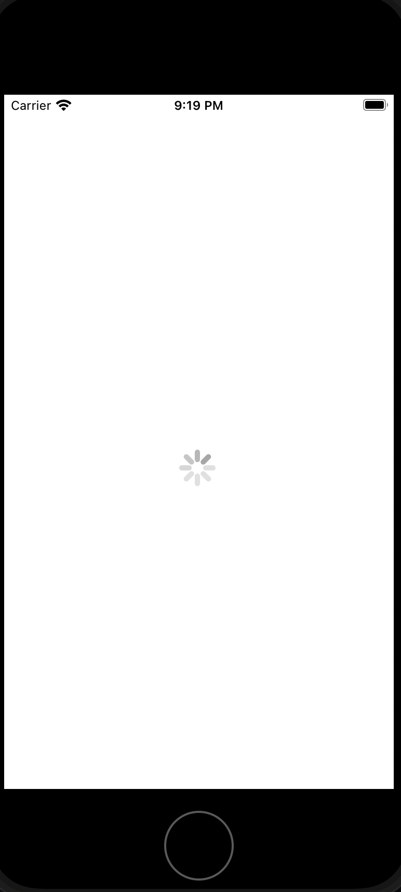
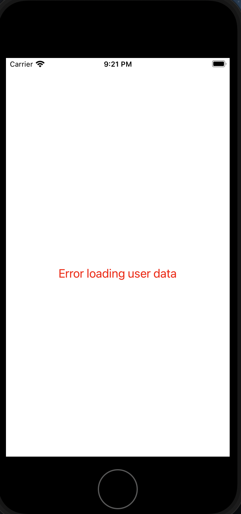
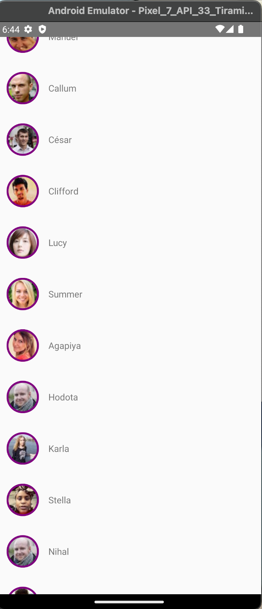
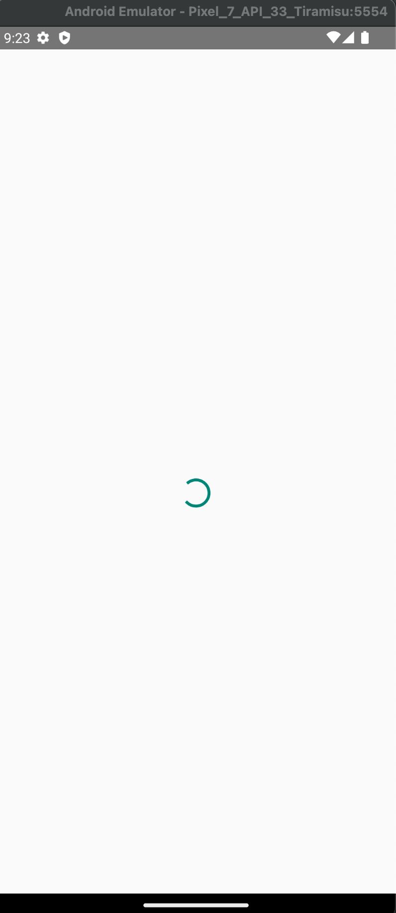
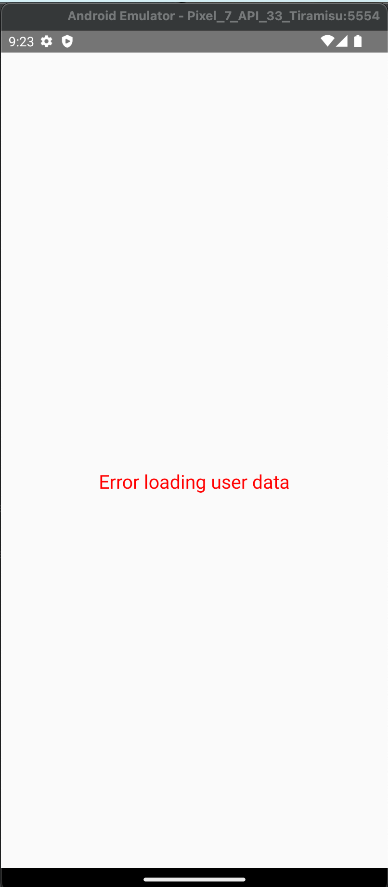

# React Native User List Mobile App
A mobile app that fetches user data from an API via a network request and renders the data on screen. Leverages Redux Toolkit to handle state management (including loading and error states), and pagination.

**Technologies used:** React Native, TypeScript, Redux Toolkit, and randomuser.me API

## Install Steps:

Init React Native Project:  
npx react-native@latest init <ProjectName>

Redux Installs:  
npm i @reduxjs/toolkit react-redux

Types Checking Install:  
npm i @types/react-native

After installation, run "**npm start**" to start the Metro bundler, then type "**i**" to run it on iOS or "**a**" to run it on Android. Alternatively, you can run "**npm run ios**" or "**npm run android**" in a new terminal window after starting the Metro bundler.

randomuser.me API endpoint:  
`https://randomuser.me/api/?page=${page}&results=${count}`, where page is the page number and count is the number of results per page.

## Screenshots
### iPhone Screenshots
**User List:**

 
 

**Loading:**

 
 

**Error:**

 
 

### Android Screenshots:

**User List:**  

 
 

**Loading:**  

 
 

**Error:**

